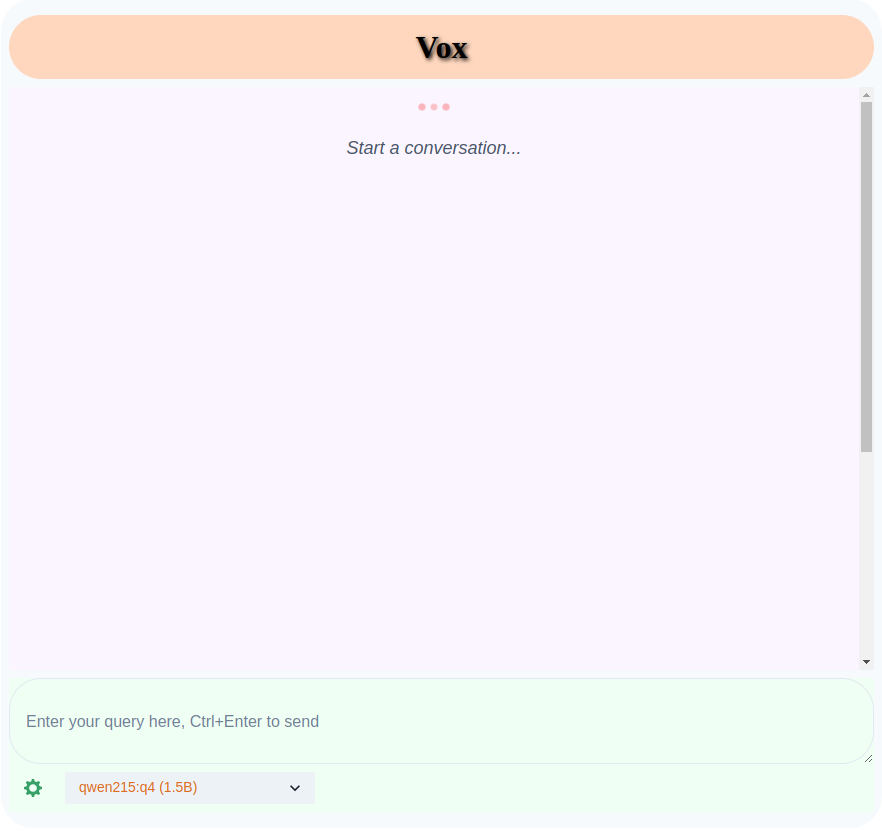
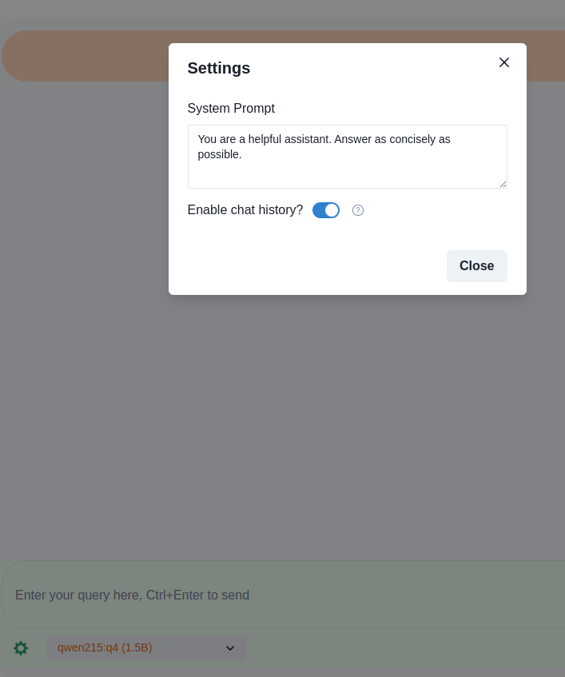
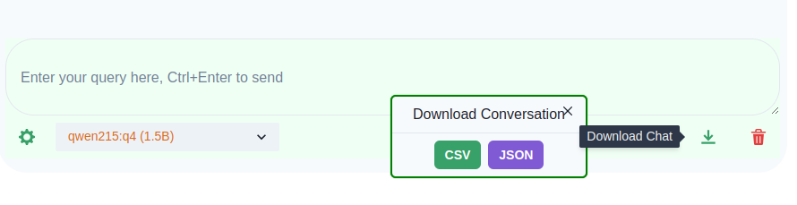
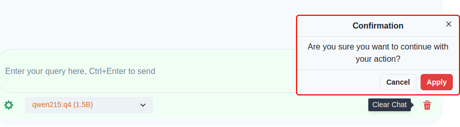

### Vox is a wrapper UI and Server that works with [Ollama](https://ollama.com/)

### Build from source

- use [just](https://github.com/casey/just/releases) to perform the build
- `just build` will build both UI and Server
- UI Dependencies
  - nodejs
  - bun
  - vite
- Server Dependencies
  - go 1.22.0 or higher

### Environment Variables

| Name     | Description                    |
| :------- | :----------------------------- |
| LLM_URL  | Ollama server URL              |
| APP_PORT | Port of the application server |

- Update the values in the `.env` file.

### Generate SSL Certificates

- `make sslcert`
- `openssl req -x509 -newkey rsa:4096 -keyout ./sslcerts/nginx.key -out ./sslcerts/nginx.crt -days 365 -nodes -subj "/C=US/ST=NY/L=New York/O=LLM/OU=LLM/CN=example.com"`

* Modify Country, State, Locality, Organization, Organization Unit, Common Name, Email Address in the above command.

### Screenshots

